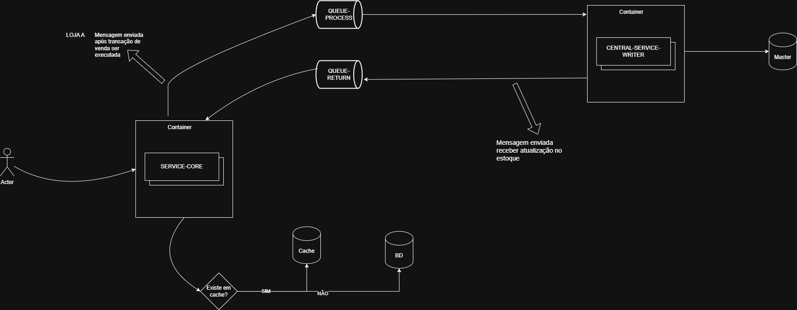

# Sistema de Gestão de Estoque - Inventory Management Service

## 📋 Descrição

Sistema de gestão de estoque distribuído desenvolvido em Java com Spring Boot, projetado para gerenciar inventário de uma rede de lojas de varejo. O sistema oferece uma API REST completa para operações de estoque, com suporte a cache distribuído e mensageria assíncrona.

## 🏗️ Arquitetura



### Entidades Principais

- **ProductEntity**: Representa os produtos do catálogo
- **StoreEntity**: Representa as lojas da rede
- **StockEntity**: Controla o estoque de cada produto em cada loja
- **StockMovementEntity**: Registra todas as movimentações de estoque

### Stack Tecnológica

- **Java 21**
- **Spring Boot 3.5.5**
- **Spring Data JPA**
- **Spring Data Redis** (cache distribuído)
- **Spring AMQP** (mensageria com RabbitMQ)
- **H2 Database** (desenvolvimento)
- **Lombok** (redução de boilerplate)
- **MapStruct 1.5.5** (mapeamento de objetos)
- **SpringDoc OpenAPI 2.1.0** (documentação Swagger)
- **Jakarta Validation 3.0.2** (validação de dados)
- **Maven** (gerenciamento de dependências)

## 🚀 Como Executar

### Pré-requisitos
- Java 21
- Maven 3.6+
- Docker (opcional, para Redis e RabbitMQ)

### Executando a aplicação

```bash
# Clone o repositório
git clone <repository-url>
cd inventory-management-service

# Compile o projeto
mvn clean compile

# Execute a aplicação
mvn spring-boot:run
```

### Executando com Docker

```bash
# Execute os serviços auxiliares (Redis, RabbitMQ)
docker-compose -f docker-compose-sub.yaml up -d

# Execute a aplicação
mvn spring-boot:run -Dspring-boot.run.profiles=docker
```

### Acessando a aplicação

- **API Base**: http://localhost:8080/api/v1
- **Documentação Swagger**: http://localhost:8080/swagger-ui.html
- **Console H2**: http://localhost:8080/h2-console
  - JDBC URL: `jdbc:h2:mem:testDb`
  - Username: `sa`
  - Password: (deixe em branco)
- **Actuator**: http://localhost:8080/actuator

## 📊 Modelo de Dados

### Relacionamentos

```
Store (1) -----> (N) Stock (N) <----- (1) Product
                     |
                     v
               StockMovement
```

### Campos Principais

#### Product
- `id` (UUID)
- `sku` (String, único)
- `name` (String)
- `description` (String)
- `category` (Enum)

#### Store
- `id` (UUID)
- `storeCode` (String, único)
- `name` (String)
- `address`, `city`, `state`, `zipCode`
- `active` (Boolean)

#### Stock
- `id` (UUID)
- `productId` (UUID)
- `storeId` (UUID)
- `quantity` (Integer)
- `reservedQuantity` (Integer)
- `availableQuantity` (Integer)
- `minimumStock` (Integer)
- `version` (Long) - para controle de concorrência

#### StockMovement
- `id` (UUID)
- `productId`, `storeId` (UUID)
- `movementType` (Enum): INBOUND, OUTBOUND, TRANSFER_IN, TRANSFER_OUT, ADJUSTMENT, RESERVATION, RELEASE
- `quantity`, `previousQuantity`, `newQuantity` (Integer)
- `reason`, `referenceId` (String)

## 🔧 Funcionalidades Implementadas

### ✅ Camada de Aplicação Completa
- **Controllers REST** - Endpoints para produtos e estoque
- **Application Services** - Lógica de aplicação e orquestração
- **Domain Services** - Regras de negócio complexas
- **Repository Pattern** - Acesso a dados abstraído

### ✅ API REST Documentada
- **OpenAPI/Swagger** - Documentação interativa da API
- **Validação de entrada** - Validações com Jakarta Validation
- **Tratamento de exceções** - Error handling estruturado
- **Paginação** - Suporte a consultas paginadas

### ✅ Controle de Estoque Avançado
- **Gestão completa** de produtos, lojas e estoque
- **Histórico de movimentações** com auditoria
- **Controle de estoque** disponível vs reservado
- **Validação de estoque mínimo**
- **Controle de concorrência** com versionamento otimista

### ✅ Infraestrutura Distribuída
- **Cache Redis** - Cache distribuído para performance
- **Mensageria RabbitMQ** - Comunicação assíncrona
- **Health Checks** - Monitoramento via Spring Actuator
- **Configuração por perfis** - Ambientes diferentes (dev, docker)

## 📁 Estrutura do Projeto

```
src/main/java/br/com/mercadolivre/
├── controller/               # Controllers REST
│   ├── product/
│   │   └── ProductController.java
│   └── stock/
│       └── StockController.java
├── application/             # Serviços de aplicação
│   ├── product/
│   ├── redis/
│   ├── stock/
│   └── store/
├── domain/                  # Modelos de domínio
│   ├── product/
│   └── stock/
├── infra/                   # Infraestrutura
│   ├── sql/                 # Persistência
│   └── message/             # Mensageria
├── core/                    # Configurações e utilitários
│   ├── configuration/
│   ├── constants/
│   └── exception/
└── App.java                 # Classe principal
```

## 🌐 API Endpoints

### Produtos
- `GET /api/v1/products` - Lista produtos (paginado)
- `GET /api/v1/products/{id}` - Busca produto por ID
- `GET /api/v1/products/category/{category}` - Lista produtos por categoria
- `POST /api/v1/products` - Cria novo produto

### Estoque
- `GET /api/v1/stocks` - Lista estoques
- `GET /api/v1/stocks/{id}` - Busca estoque por ID
- `POST /api/v1/stocks/purchase` - Realiza compra (reserva estoque)
- `PUT /api/v1/stocks/{id}/quantity` - Atualiza quantidade em estoque

### Documentação
- `GET /swagger-ui.html` - Interface Swagger
- `GET /v3/api-docs` - Especificação OpenAPI

## 🔍 Observabilidade

### Monitoramento
- **Spring Actuator** - Health checks e métricas
- **Logs estruturados** - Logging configurado para produção
- **Cache metrics** - Métricas do Redis
- **JPA metrics** - Métricas de performance do banco

### Endpoints de Health
- `/actuator/health` - Status geral da aplicação
- `/actuator/metrics` - Métricas detalhadas
- `/actuator/info` - Informações da aplicação

## 🔒 Segurança e Qualidade

### Implementadas
- **Controle de concorrência** com versionamento otimista
- **Validações de negócio** nas entidades de domínio
- **Auditoria completa** de movimentações
- **Validação de entrada** com Jakarta Validation
- **Exception handling** centralizado

### Testes
- **Testes unitários** - Cobertura das regras de negócio
- **Testes de integração** - Validação end-to-end
- **Test containers** - Testes com dependências reais

## 🚀 Próximas Melhorias

### Distribuição e Escalabilidade
- **Circuit Breaker** - Tolerância a falhas
- **Distributed Locks** - Para operações críticas distribuídas
- **Event Sourcing** - Para auditoria completa
- **CQRS** - Separação de leitura e escrita

### Produção
- **Database Migration** - Flyway ou Liquibase
- **Banco de Produção** - PostgreSQL ou MySQL
- **Containerização** - Dockerfile e Kubernetes
- **CI/CD Pipeline** - Deploy automatizado

## 📈 Performance

### Cache Strategy
- **Redis** configurado para cache de consultas frequentes
- **Cache invalidation** em operações de escrita
- **TTL configurável** por tipo de dado

### Database Optimization
- **Connection pooling** configurado
- **Índices otimizados** para consultas principais
- **Query optimization** com JPA/Hibernate
